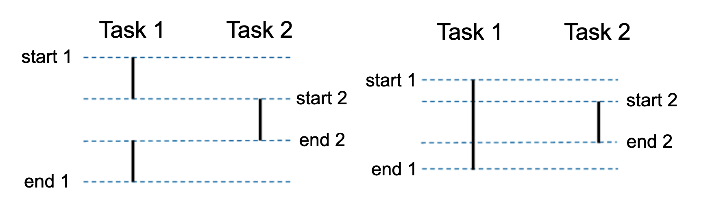
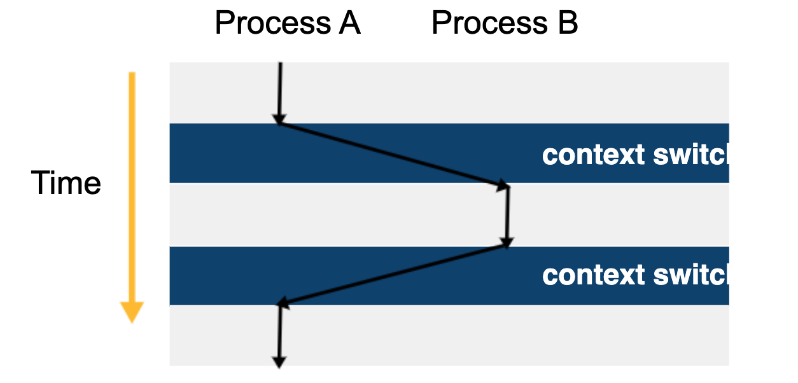
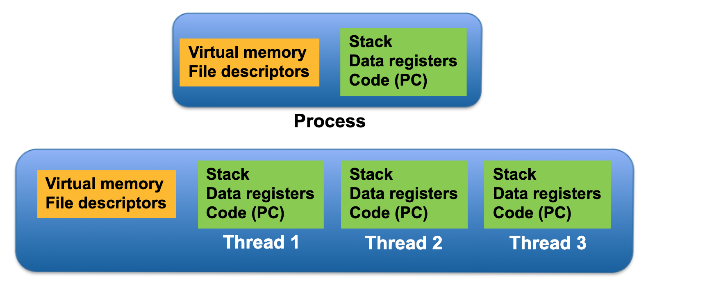
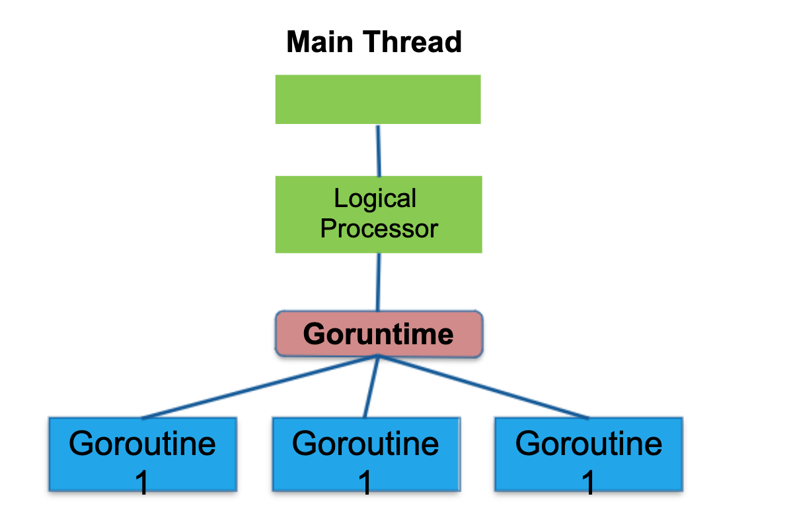
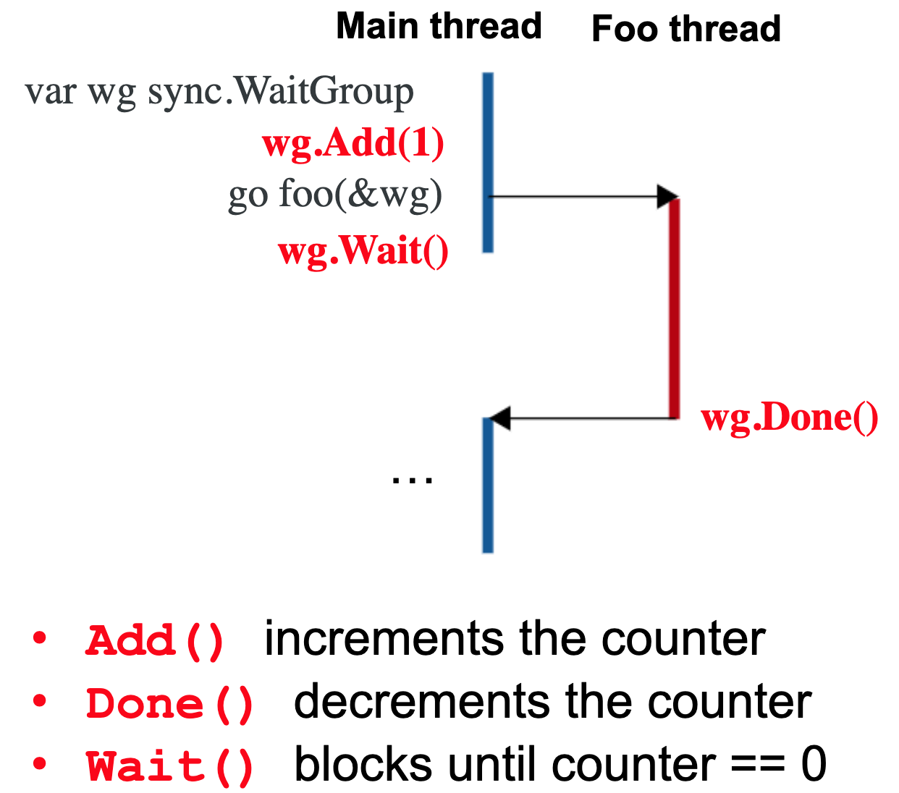
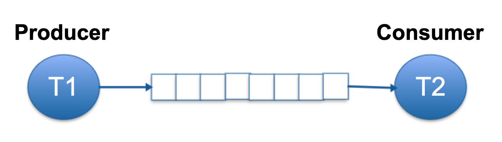

# Go Routines 

Go's approach to concurrency differs from the traditional use of threads and shared memory. Philosophically, it can be summarized:

Don't communicate by sharing memory; share memory by communicating.

Channels allow you to pass references to data structures between goroutines. If you consider this as passing around ownership of the data (the ability to read and write it), they become a powerful and expressive synchronization mechanism.

## Concurrent vs Parallel

- Concurrent execution is not necessarily the same as parallel execution
- Concurrent: start and end times overlap
- Parallel: execute at exactly the same time
- Parallel tasks must be executed on different hardware
- Concurrent tasks may be executed on the same hardware
- Only one task actually executed at a time
- Mapping from tasks to hardware is not directly controlled by the programmer
  - At least not in Go
- Programmer does not determine the hardware mapping
- Programmer makes parallelism possible
- Hardware mapping depends on many factors

## Scheduling Processes

- Operating system schedules processes for execution
- Gives the illusion of parallel execution
- OS gives fair access to CPU, memory, etc.

## Context Switch

- Control flow changes from one process to another
- Process “context” must be swapped

## Threads vs. Processes

- Many threads can exist in one process
- Threads share some context
- OS schedules threads rather than processes

## Goroutines

- Like a thread in Go
- Many Goroutines execute within a single OS thread

## Go Runtime Scheduler

- Schedules goroutines inside an OS thread
- Like a little OS inside a single OS thread
- Logical processor is mapped to a thread

## Sync WaitGroup

- Sync package contains functions to synchronize between goroutines
- sync.WaitGroup forces a goroutine to wait for other goroutines
- Contains an internal counter
  - Increment counter for each goroutine to wait for 
  - Decrement counter when each goroutine completes 
  - Waiting goroutine cannot continue until counter is 0

## Unbuffered Channel

- Unbuffered channels cannot hold data in transit
  - Default is unbuffered
- Sending blocks until data is received
- Receiving blocks until data is sent
- Channel communication is synchronous
- Blocking is the same as waiting for communication
- Receiving and ignoring the result is same as a wg.Wait()

## Buffered Channel
- Channels can contain a limited number of objects
- Capacity is the number of objects it can hold in transit
- Sending only blocks if buffer is full
- Receiving only blocks if buffer is empty
- Use of Buffering
  - Sender and receiver do not need to operate at exactly the same speed
  - Speed mismatch is acceptable
  - Average speeds must still match

## Dining Philosophers

[dining_philosophers](https://github.com/lee-hen/Algorithms/5_context_or_beyond/101_go_routines/18_dining_philosophers)

## Concurrency Patterns

[concurrency_patterns](https://github.com/lee-hen/Algorithms/5_context_or_beyond/101_go_routines/17_concurrency_patterns)
